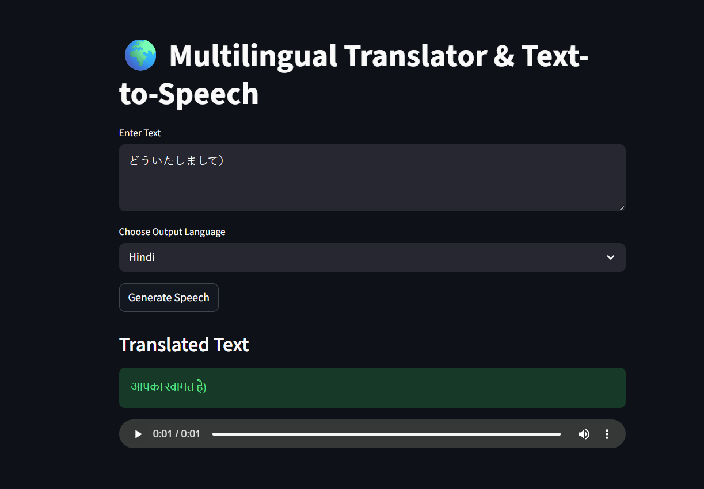

#  Multilingual AI Translator & Text-to-Speech App

A multilingual web application built using **Python**, **Streamlit**, **gTTS**, and **Deep Translator** that translates text into different languages and converts it into natural sounding speech audio.

---

 

## 🚀 Features

* Translate text into multiple languages
* Convert translated text into speech
* Support for many languages using Google TTS
* Real-time translated text display
* Audio playback inside the web application
* User-friendly Streamlit interface

---

## 🛠️ Tech Stack

* Python
* Streamlit
* gTTS (Google Text-to-Speech)
* Deep Translator

---

## 📸 Application Workflow

1. User enters text.
2. Selects target language.
3. Application translates the text automatically.
4. Translated text is displayed on screen.
5. Speech audio is generated and played.

---

## 📦 Installation

Clone the repository:

```bash
git clone https://github.com/your-username/your-repository-name.git
```

Move into the project directory:

```bash
cd your-repository-name
```

Install dependencies:

```bash
pip install -r requirements.txt
```

---

## ▶️ Run the Application

```bash
streamlit run app.py
```

---

## Example Output

Input:

```text
Hello, I am learning Artificial Intelligence.
```

Selected Language: **Hindi**

Translated Output:

```text
नमस्ते, मैं कृत्रिम बुद्धिमत्ता सीख रहा हूँ।
```

Generated Result:

✔ Display translated text
✔ Generate Hindi speech audio

---

## Future Improvements

* Audio download feature
* Speech speed control
* Voice input using microphone
* Dark mode UI customization
* Speech-to-Text integration

---

## 👨‍💻 Author

Sonu Kumar

If you found this project useful, consider giving it a ⭐ on GitHub.
